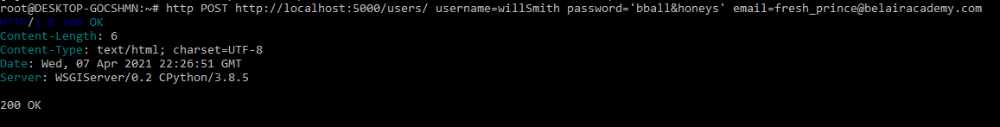
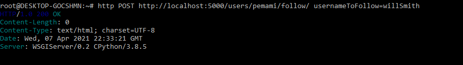
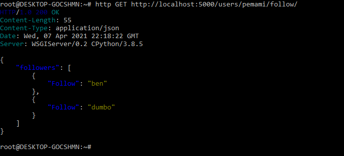
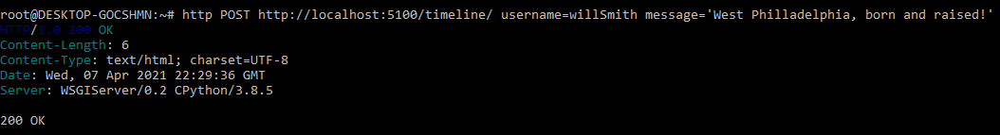
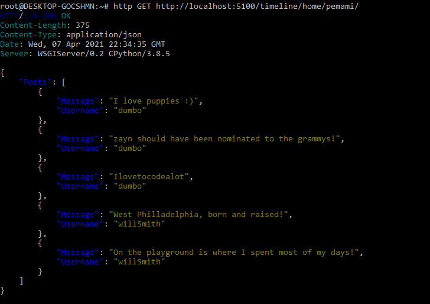

# Welcome to my RESTful Microservices Project!

## About
TwitterLite is a simple RESTful back-end implementation of a twitter-like social network. 
It gives clients the ability to create and access accounts, follow other accounts, and view timelines consisting of posts that are public, their own, or from people they follow.
The application is built on the Python Bottle framework alongside a SQLite database. Our back-end is divided into two microservices:

  - Users: Allows for account creation and usage functionality, including user credentials and accounts being followed
  - Timelines: Gives clients the ability to view posts and timelines. Communicates with the Users service to provide account-specific services 
  
 NOTE: twitterLite does not currently enforce authentication, but has the existing infastrucutre to do so in the future.

 ## Examples

 Below are a few screenshots of the API in use:

 ### Creating an account with the Users service 

  

 ### Following a new user

  

 ### Retrieving users Following

  

 ### Crating a posts

  

 ### Retrieving a user's timeline 
 NOTE: this request in particular involves our Timelines service talking to our Users service in order to provide you with posts only from those you follow

  

## Usage 

### Dependencies
    - sqlite3
    - Python 3 
    - Python Bottle
    - Python Requests
    - Foreman

### Running
Once you have downloaded the repository along with its dependencies, navigate to the project's root directory in your CL and enter `foreman start`
The response should look something like this:

As you can see, foreman will run the services on your localhost ports 5000 & 5100 by default, but you can specify different ports in the CL arguement if this presents an issue

